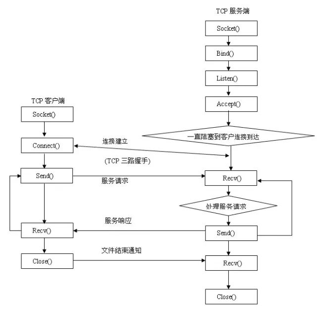
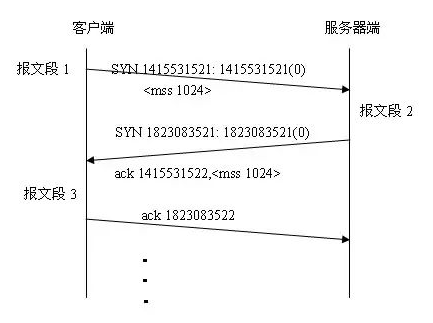
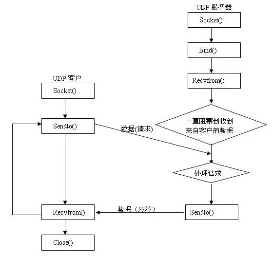

# 流程
### TCP 传输控制协议
面向连接的通信提供序列化、可靠的和不重复的数据交付，而没有记录边界。意味着每条消息都可以拆分多个片段，并且每个消息片段都能到达目的地，然后将它们按顺序组合在一起,最后将完整的信息传递给等待的应用程序。

- 服务器端编程的步骤
    1. 创建套接字(socket())
    2. 绑定套接字到一个IP地址和一个端口上(bind())
    3. 将套接字设置为监听模式等待连接请求(listen())
    4. 请求到来后，接受连接请求，返回一个新的对应于此次连接的套接字(accept())
    5. 用返回的套接字和客户端进行通信(send()/recv())
    6. 返回，等待另一连接请求(此处是保持本连接并转去接收另外新的连接，并行的)
    7. 关闭套接字(closesocket())

- 客户端编程的步骤
    1. 创建套接字(socket())
    2. 向服务器发出连接请求(connect())
    3. 和服务器端进行通信(send()/recv())
    4. 关闭套接字(closesocket())

#### 三次握手
1. 客户端发送一个SYN段（同步序号）指明客户打算连接的服务器端口，以及初始化序号(ISN) 
2. 服务器发回包含服务器的初始序号的SYN报文段作为应答。同时，将确认序号(ACK)设置为客户的ISN加1以对客户的SYN 报文段进行确认。一个SYN将占用一个序号
3. 客户必须将确认序号设置为服务器的ISN加1以对服务器的SYN报文段进行确认

#### TCP优缺点
##### 优点
可靠，稳定 TCP的可靠体现在TCP在传递数据之前，会有三次握手来建立连接，而且在数据传递时，有确认、窗口、重传、拥塞控制机制，在数据传完后，还会断开连接用来节约系统资源。

1. TCP提供以认可的方式显式地创建和终止连接
2. TCP保证可靠的、顺序的（数据包以发送的顺序接收）以及不会重复的数据传输
3. TCP处理流控制
4. 允许数据优先
5. 如果数据没有传送到，则TCP套接口返回一个出错状态条件
6. TCP通过保持连续并将数据块分成更小的分片来处理大数据块。无需程序员知道

##### 缺点
1. TCP在转移数据时必须创建（并保持）一个连接。这个连接给通信进程增加了开销，让它比UDP速度要慢。
2. 慢，效率低，占用系统资源高，易被攻击 TCP在传递数据之前，要先建连接，这会消耗时间，而且在数据传递时，确认机制、重传机制、拥塞控制机制等都会消耗大量的时间，而且要在每台设备上维护所有的传输连接，事实上，每个连接都会占用系统的CPU、内存等硬件资源。 而且，因为TCP有确认机制、三次握手机制，这些也导致TCP容易被人利用，实现DOS、DDOS、CC等攻击。

#### 什么时候应该使用TCP
当对网络通讯质量有要求的时候
- 整个数据要准确无误的传递给对方，这往往用于一些要求可靠的应用，比如HTTP、HTTPS、FTP等传输文件的协议，POP、SMTP等邮件传输的协议。 
- 常见使用TCP协议的应用： 浏览器用的HTTP；Outlook用的POP、SMTP；Putty用的Telnet、SSH；QQ文件传输.

### UDP
面向无连接的套接字，数据报类型的套接字, 即在通信开始之前并不需要建议连接,当然也无法保证它的顺序性、可靠性或重复性

- 服务器端编程的步骤
    1. 创建套接字(socket())
    2. 绑定套接字到一个IP地址和一个端口上(bind())
    3. 等待和接收数据(sendto()/recvfrom())
    4. 关闭套接字(closesocket())

- 客户端编程步骤
    1. 创建一个套接字(socket())
    2. 向服务器发送数据(sendto());
    3. 关闭套接字

#### UDP优缺点
1. UDP不要求保持一个连接
2. UDP没有因接收方认可收到数据包（或者当数据包没有正确抵达而自动重传）而带来的开销。
3. 设计UDP的目的是用于短应用和控制消息
4. 在一个数据包连接一个数据包的基础上，UDP要求的网络带宽比TDP更小。

##### 优点
- 快，比TCP稍安全：UDP没有TCP的握手、确认、窗口、重传、拥塞控制等机制，UDP是一个无状态的传输协议，所以它在传递数据时非常快。没有TCP的这些机制，UDP较TCP被攻击者利用的漏洞要少一些。但UDP也是无法避免攻击的，比如：UDP Flood攻击

##### 缺点
- 不可靠，不稳定：因为UDP没有TCP那些可靠的机制，在数据传递时，如果网络质量不好，就会很容易丢包。

##### 什么时候应该使用UDP
当对网络通讯质量要求不高的时候，要求网络通讯速度能尽量的快时
- 比如，日常生活中，常见使用UDP协议的应用： QQ语音；QQ视频；TFTP ……

### 对比
从上面的流程图比较我们可以很明显的看出UDP没有三次握手过程。简单点说，UDP处理的细节比TCP少。UDP不能保证消息被传送到（它也报告消息没有传送到）目的地。UDP也不保证数据包的传送顺序。UDP把数据发出去后只能希望它能够抵达目的地

### TCP与UDP区别
1. TCP面向连接（如打电话要先拨号建立连接）;UDP是无连接的，即发送数据之前不需要建立连接
2. TCP提供可靠的服务。也就是说，通过TCP连接传送的数据，无差错，不丢失，不重复，且按序到达;UDP尽最大努力交付，即不保证可靠交付
3. TCP面向字节流，实际上是TCP把数据看成一连串无结构的字节流;UDP是面向报文的，没有拥塞控制，因此网络出现拥塞不会使源主机的发送速率降低（对实时应用很有用，如IP电话，实时视频会议等）
4. 每一条TCP连接只能是点到点的;UDP支持一对一，一对多，多对一和多对多的交互通信
5. TCP首部开销20字节;UDP的首部开销小，只有8个字节
6. TCP的逻辑通信信道是全双工的可靠信道，UDP则是不可靠信道

参考资料
1. [Socket编程TCP/UDP——（一）](https://www.jianshu.com/p/8264ffefb51d)
2. [基于 Socket 的 UDP 和 TCP 编程介绍](https://zhuanlan.zhihu.com/p/73514975)
3. [Python 之 Socket编程(TCP/UDP)](https://www.jianshu.com/p/629961795744)